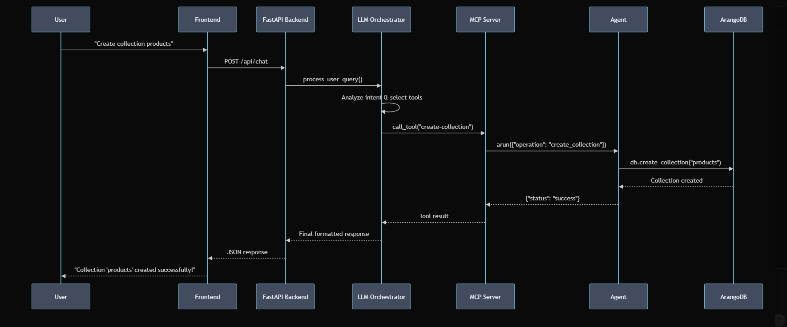

# arango-mcp-server
# ArangoDB AI Chatbot - Natural Language Database Interface

An intelligent chatbot application that lets you interact with ArangoDB databases using **natural language**. Simply type what you want to do, and the AI will understand and execute the appropriate database operations for you.

##  Quick Setup and Run

### Prerequisites
- Python 3.10+
- ArangoDB instance running on `localhost:8529`
- Google Gemini API key

### 1. Install Dependencies
```bash
pip install -r requirements.txt
```

### 2. Environment Setup
Create a `.env` file in the project root:
```env
# ArangoDB Configuration
ARANGO_HOSTS=http://localhost:8529
ARANGO_ROOT_USERNAME=root
ARANGO_ROOT_PASSWORD=your_password
ARANGO_DEFAULT_DB_NAME=_system

# Google Gemini API
GEMINI_API_KEY=your_gemini_api_key_here

# Service URLs
MCP_SERVER_URL=http://localhost:8000/mcp
FASTAPI_BACKEND_URL=http://localhost:8001
```

### 3. Start the Services
You need to run all three components in separate terminals:

#### Terminal 1: Start MCP Server
```bash
python -m mcp_server.main
```

#### Terminal 2: Start FastAPI Backend
```bash
python -m fastapi_client_backend.main
```

#### Terminal 3: Start Frontend
```bash
python -m frontend.app
```

### 4. Access the Application
Open your browser and go to: `http://localhost:5000`

## Project Structure

```
arangodb_mcp_chatbot_poc/
├── fastapi_client_backend/         # FastAPI orchestrator service
│   ├── config.py                   # Configuration settings
│   ├── llm_orchestrator.py         # LLM processing logic
│   ├── main.py                     # FastAPI application
│   └── mcp_client_setup.py         # MCP client configuration
├── frontend/                       # Web interface
│   ├── app.py                      # Flask application
│   ├── static/                     # CSS and JavaScript files
│   └── templates/                  # HTML templates
├── mcp_server/                     # MCP server with ArangoDB agents
│   ├── agents/                     # Specialized database agents
│   │   ├── database_management_agent.py      # Database operations
│   │   ├── collection_management_agent.py    # Collection operations  
│   │   ├── document_crud_agent.py            # Document CRUD
│   │   ├── aql_execution_agent.py            # AQL query execution
│   │   ├── graph_management_agent.py         # Graph operations
│   │   ├── index_management_agent.py         # Index management
│   │   ├── view_management_agent.py          # View operations
│   │   └── analyzer_management_agent.py      # Analyzer management
│   ├── mcp_tools/                  # Tool implementations
│   │   ├── database_tools.py       # Database MCP tools
│   │   ├── collection_tools.py     # Collection MCP tools
│   │   ├── document_tools.py       # Document MCP tools
│   │   ├── aql_tools.py           # AQL MCP tools
│   │   ├── graph_tools.py         # Graph MCP tools
│   │   ├── index_tools.py         # Index MCP tools
│   │   ├── view_tools.py          # View MCP tools
│   │   └── analyzer_tools.py      # Analyzer MCP tools
│   ├── arango_connector.py         # Database connection logic
│   ├── config.py                   # Server configuration
│   ├── main.py                     # Server entry point
│   └── server.py                   # MCP server setup
├── requirements.txt                # Python dependencies
└── README.md                       # This file
```

## Architecture



### High-Level Overview

This application implements a **3-tier architecture** with natural language processing capabilities:

```
┌─────────────────┐    ┌─────────────────┐    ┌─────────────────┐    ┌─────────────────┐
│   Web Frontend  │    │  FastAPI Backend │    │   MCP Server    │    │    ArangoDB     │
│   (Flask App)   │◄──►│  (Orchestrator)  │◄──►│   (Agents)      │◄──►│   (Database)    │
│                 │    │                 │    │                 │    │                 │
│ - User Interface│    │ - LLM Processing│    │ - 8 Agents      │    │ - Data Storage  │
│ - Chat UI       │    │ - MCP Client    │    │ - 32 Tools      │    │ - Query Engine  │
│ - HTTP Requests │    │ - API Endpoints │    │ - DB Operations │    │ - ACID Trans.   │
└─────────────────┘    └─────────────────┘    └─────────────────┘    └─────────────────┘
        │                        │                        │                        │
        │                        │                        │                        │
    Port 5000              Port 8001                Port 8000                Port 8529
```

### Component Architecture

#### 1. **Frontend Layer** (`frontend/`)
- **Technology**: Flask + HTML/CSS/JavaScript
- **Purpose**: User interface and interaction
- **Key Features**:
  - Chat-based interface for natural language queries
  - Real-time communication with backend
  - History management and display
  - Responsive web design

#### 2. **Orchestration Layer** (`fastapi_client_backend/`)
- **Technology**: FastAPI + Google Gemini AI
- **Purpose**: LLM orchestration and request routing
- **Key Components**:
  - **LLM Orchestrator**: Processes natural language using Gemini AI
  - **MCP Client**: Communicates with MCP server using Model Context Protocol
  - **API Gateway**: Exposes REST endpoints for frontend
- **Key Features**:
  - Natural language understanding
  - Intent classification and routing
  - Response formatting and error handling

#### 3. **Agent Layer** (`mcp_server/`)
- **Technology**: MCP (Model Context Protocol) + Python-ArangoDB
- **Purpose**: Specialized database operation handlers

### 8 Agents
The MCP Server contains 8 agents. Each agent is an expert in one specific area of database management. This separation of duties makes the system highly organized and efficient.

Here are the agents and their roles:

**Database Management Agent:**
- Responsible for high-level database operations like creating, deleting, and listing entire databases.

**Collection Management Agent:**
- Manages collections (the equivalent of tables in other databases). It handles creating, deleting, and inspecting collections.

**Document CRUD Agent:**
- The expert for all data-related operations within a collection. "CRUD" stands for Create, Read, Update, and Delete. This agent handles inserting, finding, and modifying individual data records (documents).

**AQL Execution Agent:**
- A powerful agent that can execute raw ArangoDB Query Language (AQL) queries. This is used for complex requests that go beyond simple CRUD operations.

**Graph Management Agent:**
- ArangoDB is also a graph database. This agent is specialized in creating and managing graphs, including their vertices (nodes) and edges (connections).

**Index Management Agent:**
- Manages database indexes, which are crucial for making data retrieval fast and efficient.

**View Management Agent:**
- Handles ArangoDB Views, which are used for sophisticated, high-performance searching across multiple collections (e.g., ArangoSearch).

**Analyzer Management Agent:**
- Manages Analyzers, which are components used by ArangoSearch to process and index text for full-text search capabilities.

- **Agent Architecture**:
  ```
  ┌─────────────────────────────────────────────────────────────┐
  │                    MCP Server                               │
  │  ┌─────────────────┐  ┌─────────────────┐  ┌──────────────┐ │
  │  │  Agent Router   │  │   Tool Registry │  │ ArangoDB     │ │
  │  │                 │  │                 │  │ Connector    │ │
  │  └─────────────────┘  └─────────────────┘  └──────────────┘ │
  │           │                     │                   │       │
  │  ┌─────────────────────────────────────────────────────────┐ │
  │  │                    8 Specialized Agents                │ │
  │  │ ┌─────────────┐ ┌─────────────┐ ┌─────────────┐ ┌──────┐│ │
  │  │ │ Database    │ │ Collection  │ │ Document    │ │ AQL  ││ │
  │  │ │ Agent       │ │ Agent       │ │ CRUD Agent  │ │Agent ││ │
  │  │ └─────────────┘ └─────────────┘ └─────────────┘ └──────┘│ │
  │  │ ┌─────────────┐ ┌─────────────┐ ┌─────────────┐ ┌──────┐│ │
  │  │ │ Graph       │ │ Index       │ │ View        │ │Analyz││ │
  │  │ │ Agent       │ │ Agent       │ │ Agent       │ │Agent ││ │
  │  │ └─────────────┘ └─────────────┘ └─────────────┘ └──────┘│ │
  │  └─────────────────────────────────────────────────────────┘ │
  └─────────────────────────────────────────────────────────────┘
  ```

#### 4. **Data Layer** (ArangoDB)
- **Technology**: ArangoDB Multi-Model Database
- **Purpose**: Data persistence and querying
- **Capabilities**:
  - Document store
  - Graph database
  - Key-value store
  - AQL (ArangoDB Query Language)

### Data Flow Architecture

#### Request Flow (User Query → Database Operation)
```
1. User Input
   │ "Create a collection called products"
   ▼
2. Frontend (Flask)
   │ POST /api/chat
   ▼
3. FastAPI Backend
   │ LLM Orchestrator processes natural language
   │ Gemini AI determines intent: "create collection"
   ▼
4. MCP Client
   │ Calls MCP tool: create-collection
   │ Arguments: {collection_name: "products", type: "document"}
   ▼
5. MCP Server
   │ Routes to Collection Management Agent
   ▼
6. Collection Agent
   │ Validates parameters
   │ Calls ArangoDB connector
   ▼
7. ArangoDB
   │ Executes: db.create_collection("products")
   │ Returns: Collection created successfully
   ▼
8. Response Flow (Reverse)
   │ Agent → MCP Server → FastAPI → Frontend → User
```


## API Reference

### ChatBot API Endpoints
- `POST /api/chat` - Send message to chatbot
- `GET /api/history/{user_id}` - Get chat history  
- `POST /api/history/clear/{user_id}` - Clear history
- `GET /api/health` - Check service status

### The Toolbox: 32 Available MCP Tools

To perform their jobs, the agents use a set of 32 distinct MCP tools. These are the specific, callable functions that the AI orchestrator can invoke.

**Database Tools (Managed by Database Management Agent)**
- `list-databases`
- `create-database`
- `delete-database`
- `get-database-info`

**Collection Tools (Managed by Collection Management Agent)**
- `list-collections`
- `create-collection`
- `delete-collection`
- `get-collection-properties`

**Document Tools (Managed by Document CRUD Agent)**
- `create-document`
- `create-documents-bulk`
- `read-document`
- `read-documents-with-filter`
- `update-document`

**Query Tools (Managed by AQL Execution Agent)**
- `execute-aql-query`

**Graph Tools (Managed by Graph Management Agent)**
- `list-graphs`
- `create-graph`
- `delete-graph`
- `create-edge`

**Index Tools (Managed by Index Management Agent)**
- `list-indexes`
- `create-index`
- `delete-index`

**View Tools (Managed by View Management Agent)**
- `list-views`
- `create-view`
- `delete-view`
- `update-view-properties`
- `get-view-properties`
- `replace-view-properties`

**Analyzer Tools (Managed by Analyzer Management Agent)**
- `list-analyzers`
- `create-analyzer`
- `delete-analyzer`
- `get_analyzer_properties`

### Request/Response Format
```json
// Chat Request
{
  "message": "Create a collection called products",
  "user_id": "user123"
}

// Chat Response  
{
  "response": "Collection 'products' created successfully using create-collection tool!",
  "agent_type": "collection_management"
}

// Example MCP Tool Call (Behind the scenes)
{
  "tool": "create-collection",
  "args": {
    "collection_name": "products", 
    "collection_type": "document",
    "database_name": null
  }
}
```

## Summary

This **ArangoDB AI Chatbot** represents a breakthrough in database interaction technology, providing a complete natural language interface to ArangoDB databases. Instead of writing complex queries or learning database syntax, users can simply describe what they want to do in plain English, and the AI-powered system will understand and execute the appropriate database operations.

